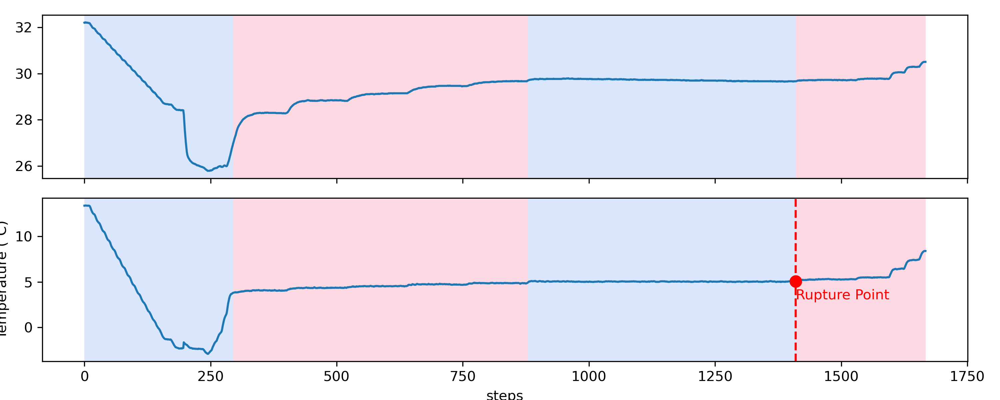
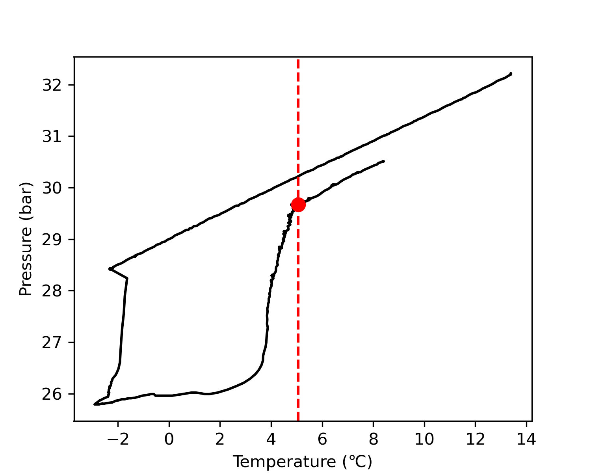
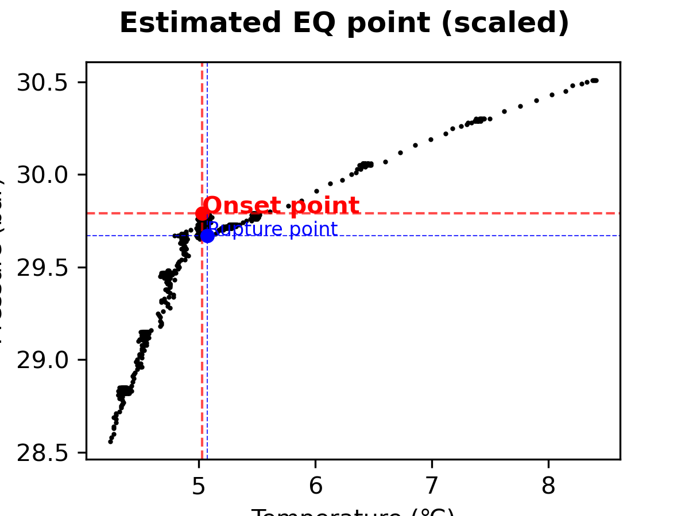
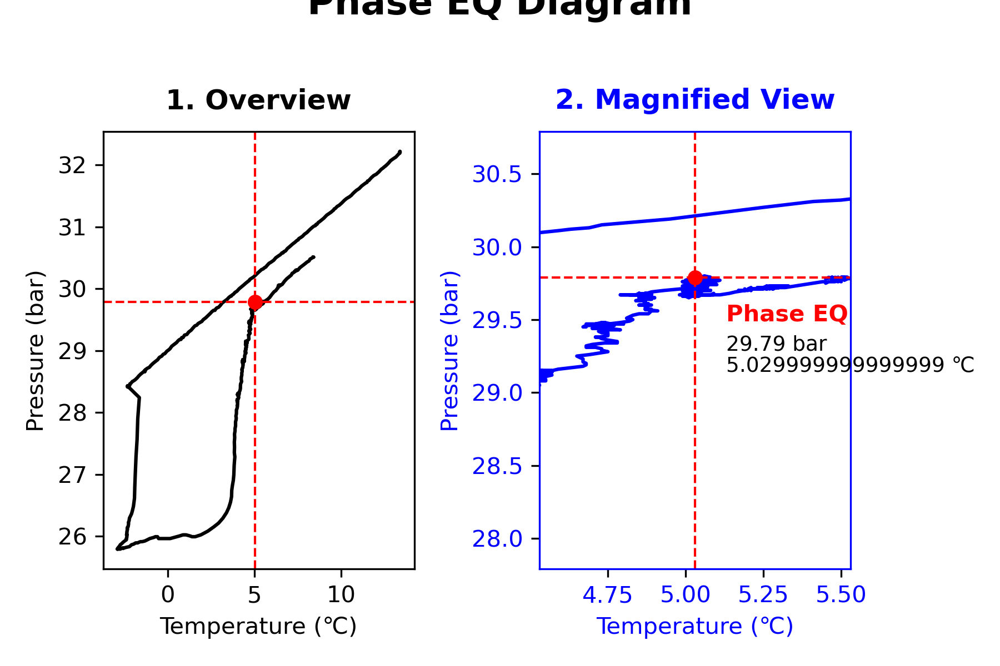

# **PyHLV**
::**Py**thon-based **H**ydrate-**L**iquid-**V**apor phase equilibrium extractor::


<br> 

<a href="https://www.buymeacoffee.com/woojingo" target="_blank"></a>

## **1. Backgrounds**
&ensp;Gas hydrate is a valuable resource due to its numerous advantages, and it is being used in various industries and applications. For example, its stability under pressure makes it an important component in natural gas processing and transportation systems, such as pipelines and subsea production. Moreover, it is being studied for other uses such as energy storage, carbon capture, and sequestration.
<br>&ensp;In order to fully exploit and manage gas hydrate resources, it is necessary to understand **the phase equilibrium, or Hydrate (H) - Liquid (L) - Vapor (V) equilibrium (EQ)**. After forming a gas hydrate inside the pressure cell (decreased pressure), the researcher must slowly dissociate the hydrate by increasing the temperature and pressure. By observing the hysteresis loop in the *pressure-temperature (P-T)* diagram, the desired equilibrium point can be achieved. Once the equilibrium point is achieved, the hydrate properties can be studied further.
<br>&ensp;Note that obtaining an equilibrium point requires the user to spend time finding the EQ point every time the experiment has finished. The procedure is time-consuming, and manual data tracking can be quite annoying for researchers. Therefore, I developed **PyHLV** to save time in finding points and plotting their curves. PyHLV is an open-source EQ point-finding package written in Python and designed to automate the process of obtaining the equilibrium point and plotting curves for the user. It accelerates the process of obtaining the equilibrium point through a series of automated calculations and plotting. Furthermore, it eliminates the need for manual data tracking, thus saving time and reducing the effort needed to complete experiments.
<br>&ensp;Furthermore, PyHLV has been tested extensively on various datasets and has proven to be a reliable and user-friendly tool for researchers. It is highly customizable and allows the user to configure the settings according to their specific needs. With PyHLV, researchers can quickly and easily obtain and plot the equilibrium point, thus significantly reducing the time spent on the experiment.

## **2. Short description**
**PyHLV** is a simple phase EQ extractor for gas hydrate researchers. It is a Python-based program that can extract the phase EQ point from the P-T data of the hydrate system. The program is designed to be simple and user-friendly, so that even a person who has no programming experience can use this. 

## **3. Features**
PyHLV offers the following features:
- **Data extraction**: Extract phase EQ point from the P-T data of the hydrate system.
- **Data visualization**: Visualize the phase EQ point with the original graph.
- **Data storage**: Store the data in the form of CSV files and zip folders.

## **4. How it works**
PyHLV works in the following steps:
1. Read the P-T data from the user-specified file.
2. Flatten the P-T data for accurate extraction of the phase EQ point.
3. Find the rupture point of the P-T data.
4. Estimate the phase EQ point by finding the line connecting the first and last points.
5. Mark the tipping point with the original graph.
6. Combine the 'Phase EQ Overview' and 'Obtained Phase EQ' graphs into the one graph.
7. Store and compress the data.
8. Export the completion message to the user.

## **5. Limitations**
PyHLV is designed to be simple and user-friendly. However, it has the following limitations:
- Only works for extracting phase equilibrium points from P-T data of the DWStemp program (Dongwon logging software; refer to the raw data stored in the `examples/` folder). If the data is from another software, the user needs to manually convert the data into a compatible format. The software will then be able to produce the equilibrium points and display them graphically.
- User must adjust option values (ninput, stepreg, pen, etc.), if P-T data is too complicated.
- Can only process one file at a time. 

## **6. Installation**
Typing the following command in the terminal will install the program.
```
$ pip install pyhlv
```

## **7. Usage**
To use the program, type the following command in the terminal.
```
$ pyhlv
```

### **Command-line arguments**
PyHLV allows users to customize their usage through command-line arguments. The available options are:
| Argument | Description | Explanations |
| --- | --- | --- |
| -p | Pressure sensor number (1 or 2), (default=1) | Pressure sensor port number you used
| -t | Temperature sensor number (1, 2, 3, or 4), (default=1) | Temperature sensor port number you used
| -n | How many inputs do you want to use? (default=2) | What number of rupture points to choose?
| -s | How many steps do you want to analyze? (default=1000) | How many points around the found rupture point to observe?
| -P | Penalty value for Pelt algorithm (default=1200) | Choose ruptures penalty value (high for sensitive, low for insensitive)
| -d | Directory location of the csv files (default=./) | Folder path with raw csv file(s)
| -v | Display the version of your installed PyHLV | Show version information to you

To use the command-line arguments, type the following command in the terminal:
```
$ pyhlv [option] [value]
```
Note that the values should be specified in the same order as the arguments. For example, to use the `-d` argument, the command should be as follows:
```
$ pyhlv -d [directorylocation]
```
For more information, type `pyhlv -h` or `pyhlv --help` in the terminal.


## **8. Required libraries**
PyHLV requires the following packages to be installed:
- `pandas`
- `numpy`
- `matplotlib`
- `seaborn`
- `ruptures`
- `tabulate`
- `pyfiglet`
- `argparse`

## **9. Gallery**
### (1) PLOT 1: Finding ruptures


### (2) PLOT 2: P-T & rupture point


### (3) PLOT 3: Estimated EQ point (scaled)


### (4) PLOT 4: Phase EQ diagram
 

### (5) DATA 1: Phase EQ data
* [Phase EQ data](https://github.com/wjgoarxiv/PyHLV/blob/1e3fbed7cee205f65988b7825d9f72f02a1b19db/Examples/results_1/Phase%20EQ%20Data.csv)

### (6) DATA 2: Tipping points
* [Tipping points](https://github.com/wjgoarxiv/PyHLV/blob/1e3fbed7cee205f65988b7825d9f72f02a1b19db/Examples/results_1/Tipping%20points.csv)

## **10. License**
This program is licensed under the MIT License. For more information, please refer to the LICENSE file.

## **11. Author**
This program was developed by [wjgoarxiv](https://github.com/wjgoarxiv)

## **12. Future work planned**
In the future, PyHLV will be improved to include additional features such as:
- Ability to <u>process multiple files at once. </u>
- Support for <u>complex P-T</u> data.
- Ability to detect <u>multi-phase regions</u> in the P-T data.

## **13. Google Colab compatible!**
Of course, you can run PyHLV in the following Google Colab notebooks. 
There are two different versions; one is a segmented version, which allows users to run each step individually, and the other is compiled version, which allows users to simply run the code.
- [Segmented Colab Notebook](https://tinyurl.com/2nq3kksu)
- [Compiled Colab Notebook](https://tinyurl.com/2fuzjxw4)
